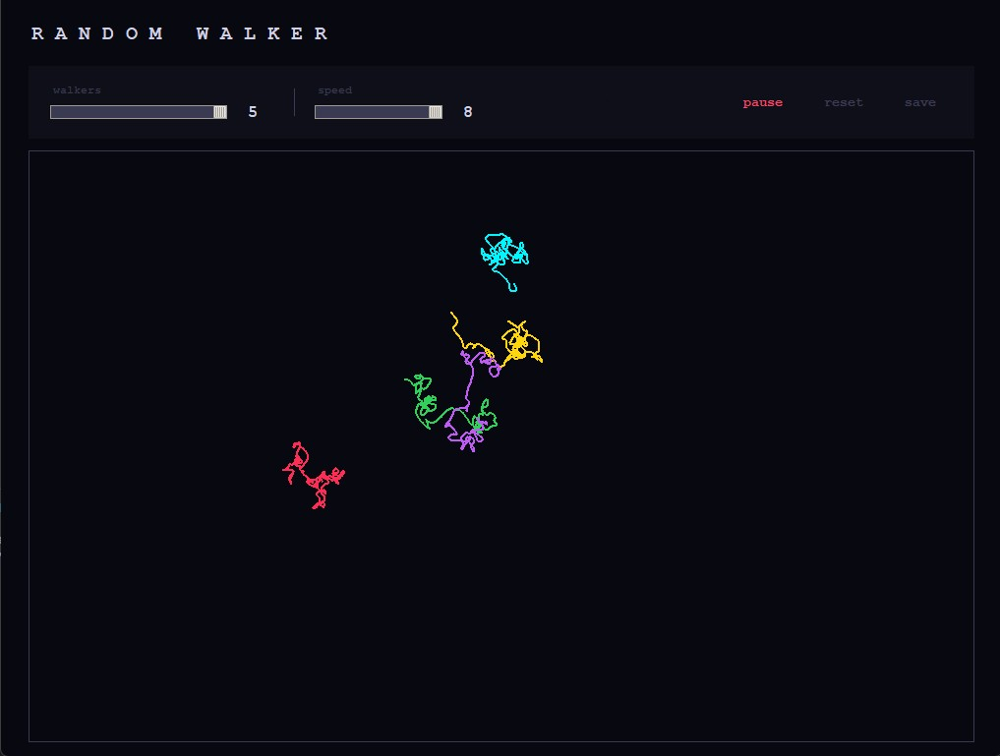
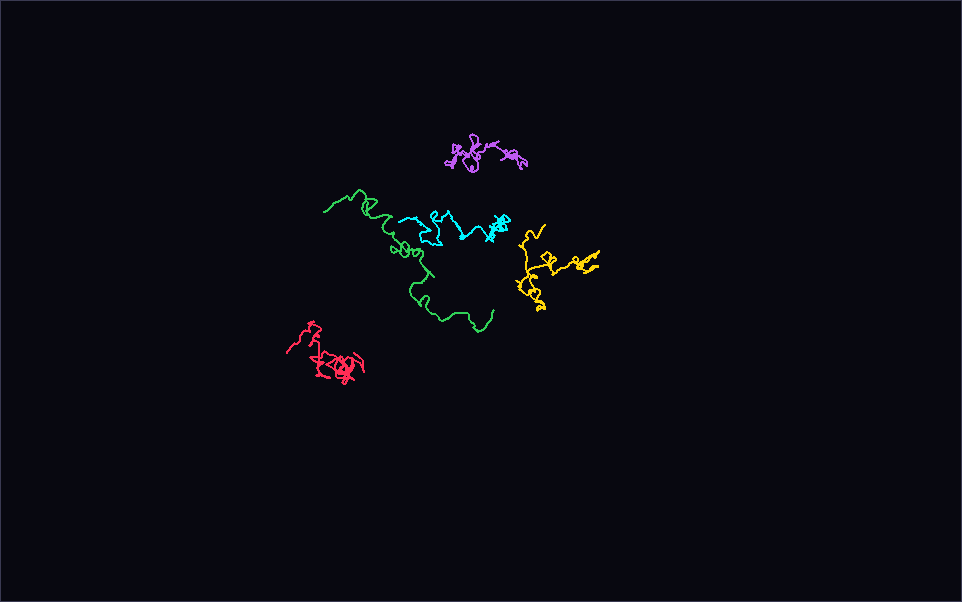

# Random Walker

A simulation where colored cells walk randomly from the center of the screen. Each cell leaves a trail behind it. When a cell hits the edge it resets and starts again from the center.

## How it works

Each walker moves one step in a random direction every frame. It draws its path as it goes. When it reaches any edge of the canvas it dies and respawns at the center.

## Saved output

When you press save, the canvas is exported as a PNG.

## Download

Go to the [Releases](../../releases) page and download the latest version. Double click the file to run it. No installation required.

## Controls

| Control | What it does |
|---|---|
| walkers | Set how many walkers to spawn (1 to 5) |
| speed | Control how fast walkers move |
| start / pause | Begin or pause the simulation |
| reset | Clear the canvas |
| save | Save the canvas as walker.png |
